# Gately

**Browser-based digital logic simulation with an experimental Arduino I/O bridge.**

[Live Demo](https://cinabono-engine-web.vercel.app/) · [Documentation](https://gately-web-documentation.vercel.app)


## Overview

**Gately is an experimental web-based logic simulator for learning and testing digital circuits before building them on a physical breadboard.** It lets you build circuits visually in the browser, run them through a custom logic engine, and inspect signal behavior in real time.

_A key part of the project is Arduino integration_: an Arduino UNO can act as a physical input/output bridge through a local Node.js agent.

## What Works Today

### Work in an IDE-style circuit workspace

Gately now opens into a conventional workbench: a toolbar across the top, a collapsible project explorer on the left, and the circuit canvas as the main editing surface. Workspaces can be saved and loaded as `.gately.json` project files, so examples and active circuits do not need to be recreated from scratch.

The app includes example workspaces at `examples/unoptimized-boolean-demo.gately.json` and `examples/clocked-shift-register-demo.gately.json`.

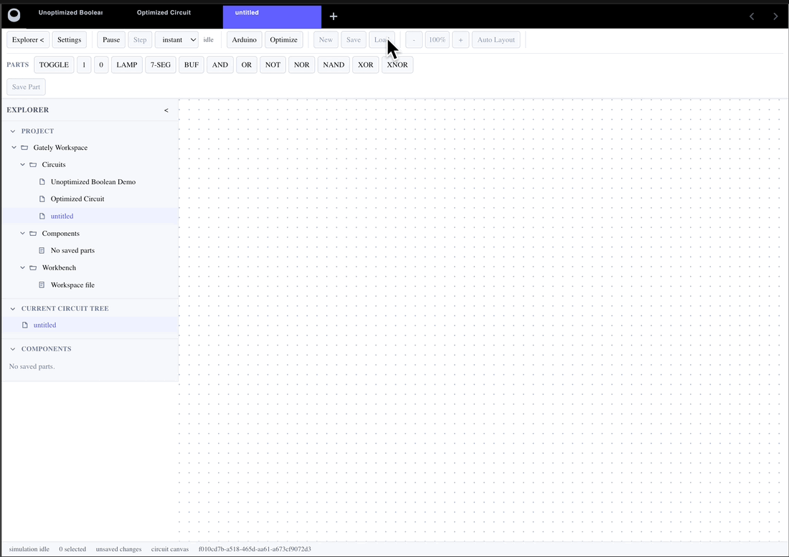

The project explorer behaves like a real file tree. Folders expand and collapse in place, circuit files use file-style entries, and selection stays separate from opening a circuit.

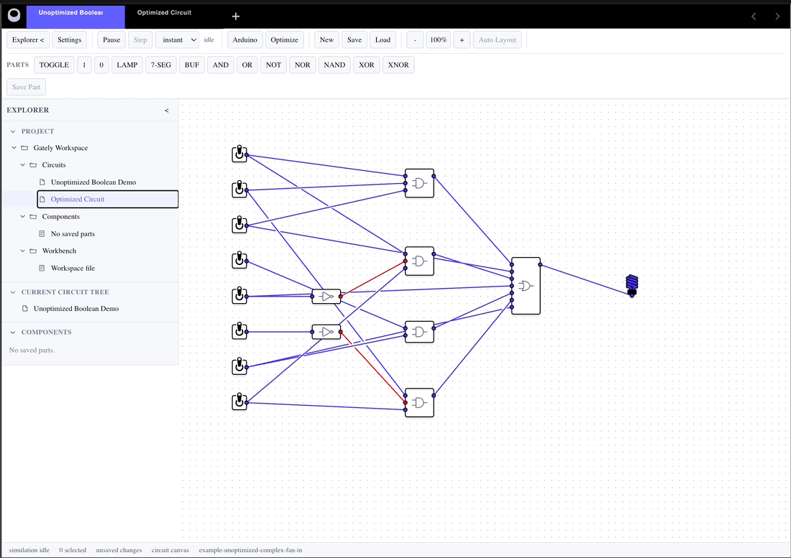

Circuit entries can be opened from the tree when that is the natural action for the item, while folders keep normal tree behavior.

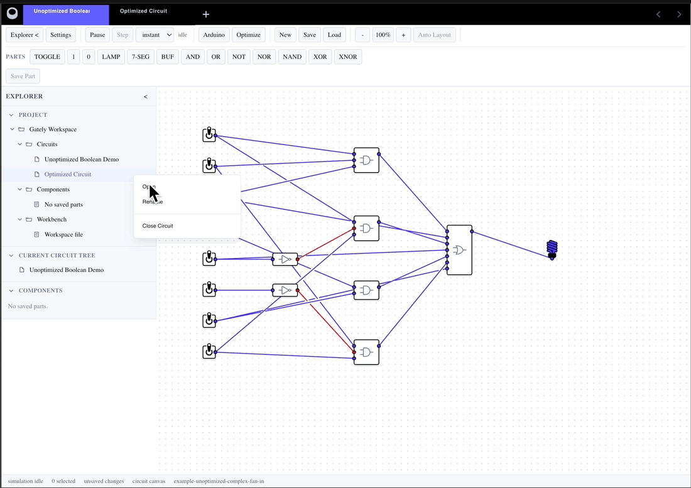

Entry actions live in context menus instead of cluttering every row. The menus are intentionally limited to actions that are actually implemented.

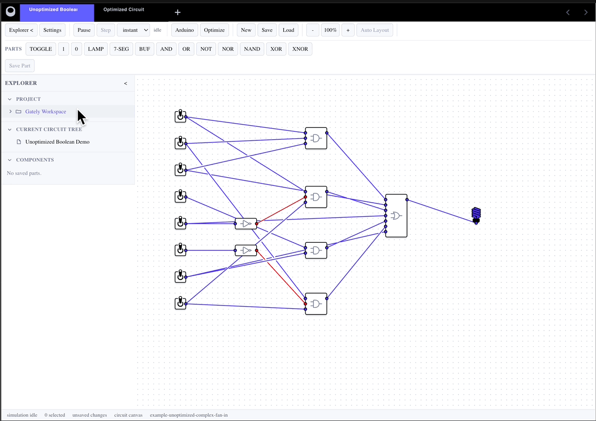

### Build and edit circuits


The current element library is split into three groups:

- basic logic gates (`Buffer`, `AND`, `OR`, `NOT`, `NAND`, `NOR`, `XOR`, `XNOR`)
- stateful logic components (`8-bit Shift Register`)
- signal generators (`Toggle`, `Clock`, `True Constant`, `False Constant`)
- output/display elements (`Lamp`, `7-segment display`)

Circuits are built by placing elements, connecting ports, and editing wires directly on the canvas.


### Analyze and optimize Boolean logic

Boolean analysis can derive a truth table from the active circuit, build Karnaugh maps for the outputs, and synthesize an optimized circuit back into the workspace.

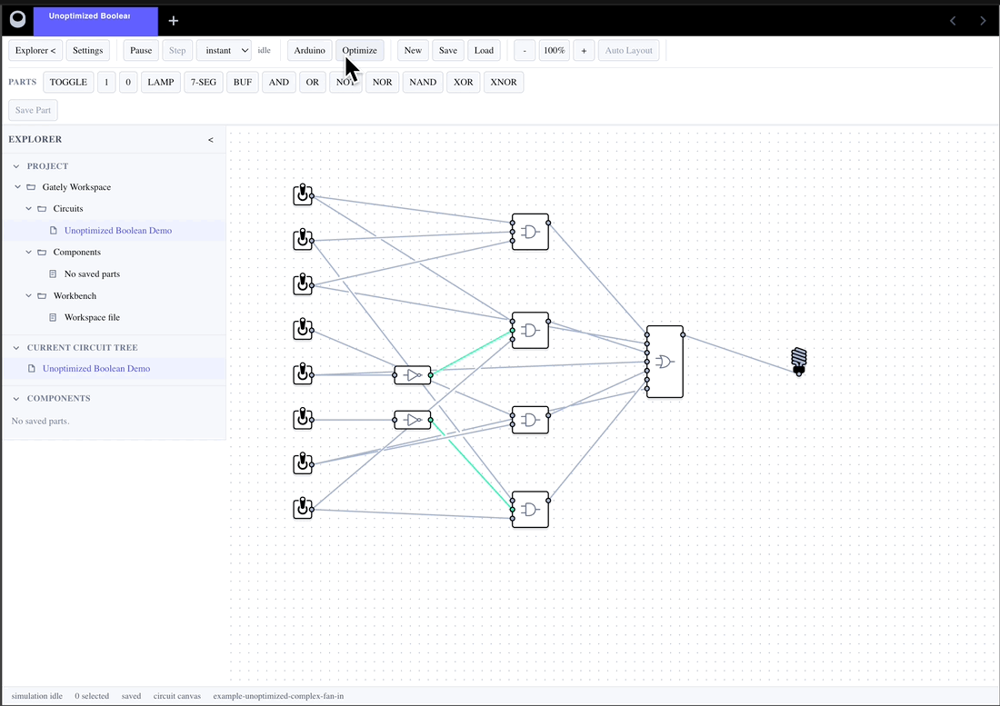

Karnaugh map groups can be inspected individually, then viewed together to understand how the minimized expression is formed.

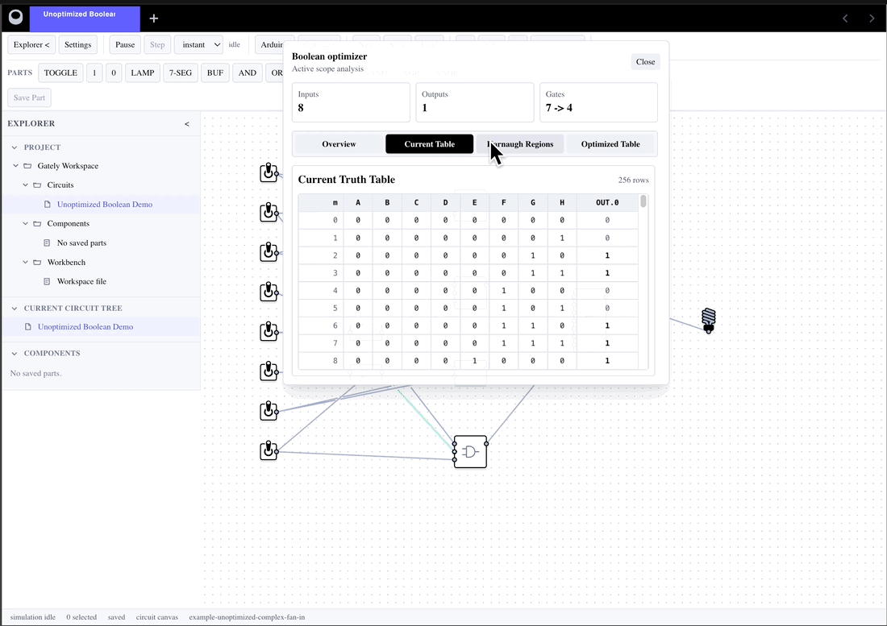

The optimizer creates a new circuit tab, lays out the synthesized gates, applies deterministic routing, and preserves live signal coloring on the optimized result.

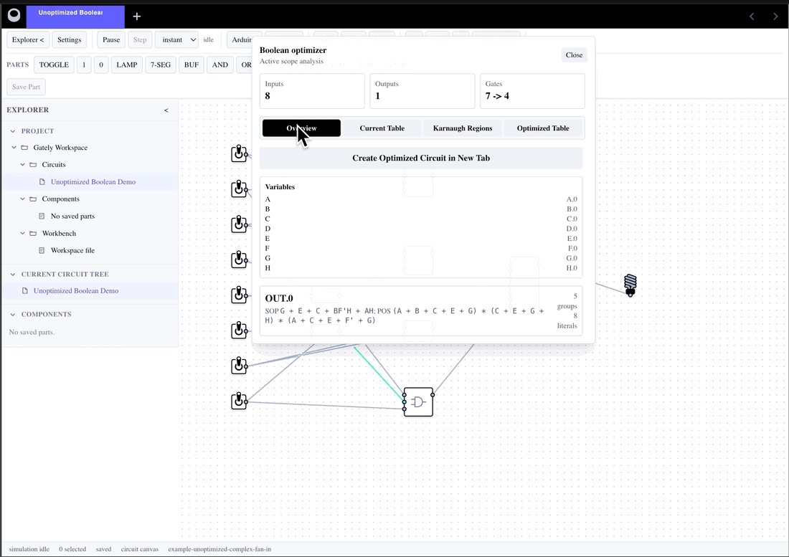

### Configure the workspace

Settings open as a full-page modal over the workbench, so configuration does not get trapped inside the canvas area.

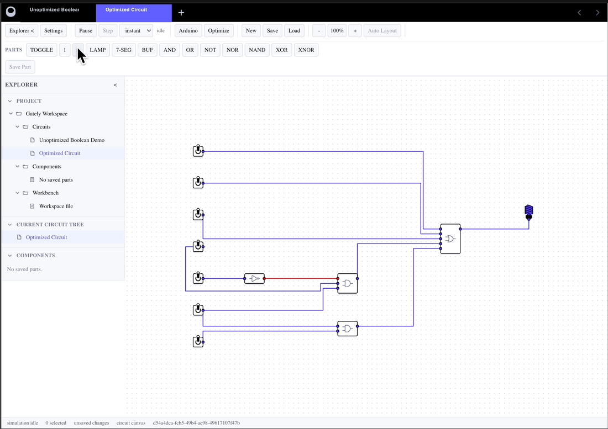

Workbench options control the project explorer, toolbar groups, and visible project sections without turning the main UI into a pile of one-off buttons.

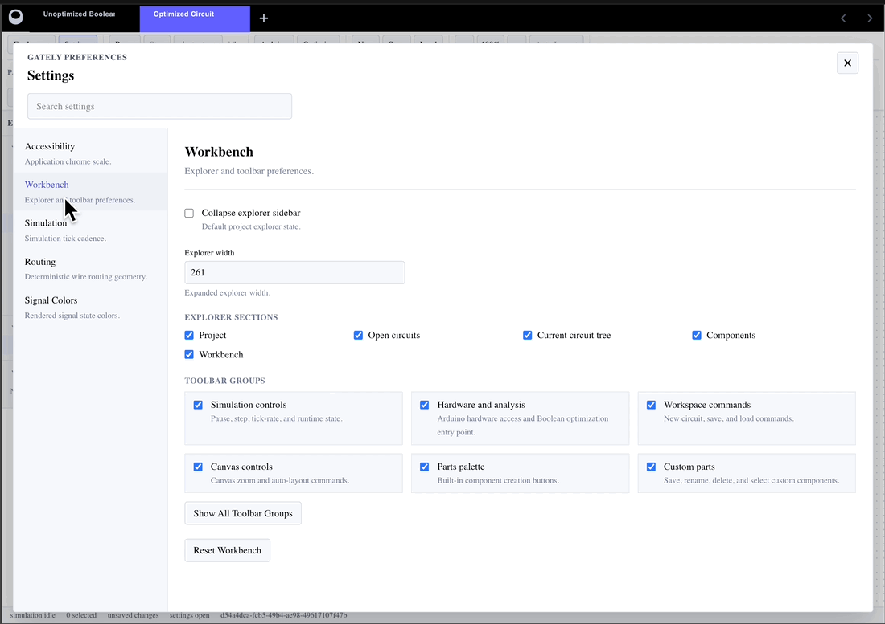

Routing and signal settings are grouped with the rest of configuration. Signal color changes apply to the current circuit immediately, which makes settings changes easy to verify.

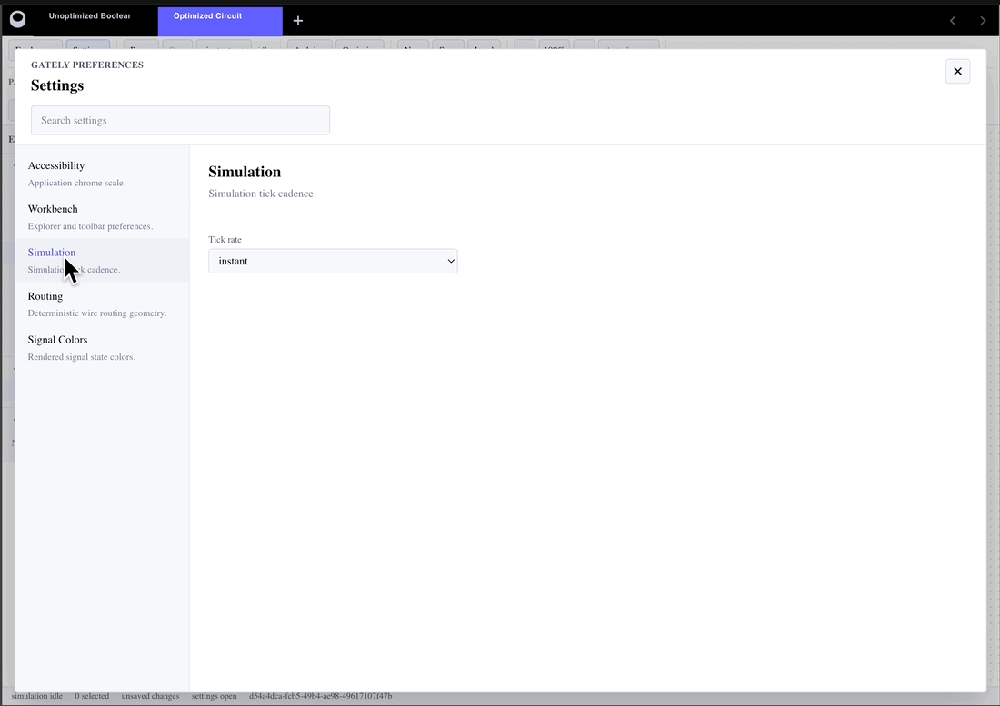

Changing a signal color is live configuration, not a deferred preference. When the high-signal color changes from green to red, the already-rendered circuit updates without reloading the file or restarting simulation.

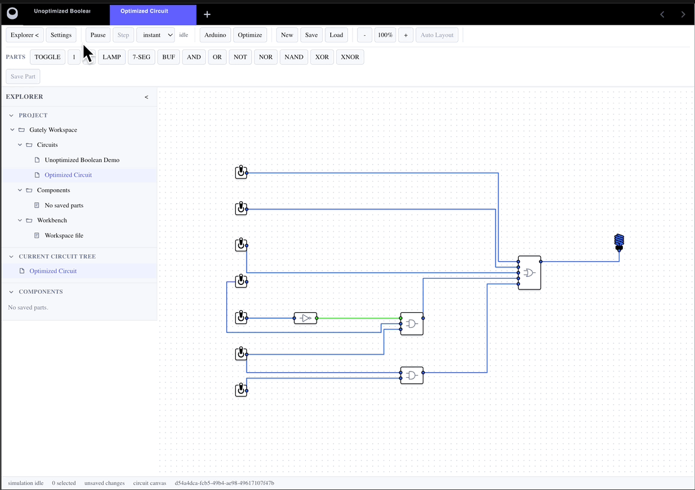

### Read signal states


Gately supports four signal states:

- `True / 1` - green.
- `False / 0` - gray.
- `Z / Hi-Z` - blue, used for disconnected inputs.
- `X / error` - pink, used when an output value is unknown or invalid.

Signal colors are configurable from the settings dialog and repaint the currently displayed circuit immediately.

### Run the simulation


Simulation can run instantly or step by step with a delay. The logic engine runs in the background through a Web Worker, so circuit computation does not block the browser UI, even with cyclic connections such as triggers or oscillated NOR.

### [Try the Arduino bridge](https://gately-web-documentation.vercel.app/#en/arduino-integration)


The Arduino integration is an early MVP. It is rough and experimental, but tests show the core idea works: physical pin changes can drive virtual circuit signals, and selected virtual signals can be written back to Arduino pins.

## Architecture & Project Layout

Gately is a pnpm/Turborepo monorepo with two applications and a set of shared packages:

- `apps/web` is the browser app, built with SolidJS, TypeScript, and Vite. It contains the user interface and the visual editor.
- The visual editor inside `apps/web` is built on top of AntV X6. It handles the graph canvas, nodes, ports, wires, and visual signal states.
- The logic computation happens on the client, but it is separated from the UI through a Web Worker. The main engine API lives in `packages/engine`, the worker bridge lives in `packages/engine-worker`, and supporting model/simulation code is split across packages such as `packages/schema` and `packages/simulation`.
- `apps/arduino-agent` is a local Node.js app. It talks to the web app through WebSocket and talks to Arduino UNO through Johnny-Five and FirmataStandard protocol.

## Run Locally

For the web app, use a modern Node.js version supported by Vite. The project was tested with Node.js `24.11.1`.

```bash
git clone https://github.com/markbrosalin/Gately.git
cd Gately
pnpm install
pnpm --filter web dev
```

Arduino is optional. The agent was tested with Node.js `18.20.8`, because Johnny-Five has not kept pace with newer Node.js releases. Upload `StandardFirmata` to your Arduino UNO, connect the board, set `ARDUINO_PORT` if auto-detection is not enough, and start the local agent:

```bash
pnpm --filter arduino-agent dev
```

The default agent URL is `ws://localhost:8787`. Full setup guides live in the [documentation](https://gately-web-documentation.vercel.app).

## Current Limitations

- No copy/paste workflow.
- No editable element names or properties.
- Arduino integration is experimental.
- Not intended for production hardware control.

## Documentation & License

Read the full guides in the [Gately web-documentation](https://gately-web-documentation.vercel.app).

Gately is released under the [MIT License](LICENSE).
